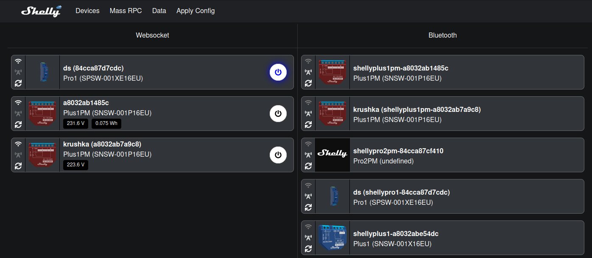

# Fleet Management

## Introduction
Fleet management is a service that allows Shelly Gen 2 devices to connect to it using their outbound websocket. The service exposes both websocket endpoints for Shelly devices and live time notifications as well as a an HTTP server with REST API for command and control.


To connect a second generation Shelly device do the following:
1. Open the Shelly device's local webpage
2. Navigate to Networks -> Outbound websocket
3. Click the toggle button that enables the outbound websocket and enter the address of the fleet management server followed by `/shelly`(hint: `ws://<your ip>:7011/shelly`). 

After that the device should show up in the home page of the application.


## Components
This repository is consisted of three modules(frontend, backend, and BLE server) combined in a single monorepo using npm workspaces. 

### Backend

- found in `/packages/backend` folder
- made with Node.js & Typescript
- Express.js for HTTP request handling
- websocket for transmitting live data
- Sqlite for storing statistical data

The backend server is the central part of the application. It stores all of the device events, statuses and consumption data. Shelly devices connect to the backend server using their outbound websockets and then they start notifying the server for any updates. When a connected Shelly device sends data to the server, the server passes it through its processing line. This includes updating the internal state of the server, storing statistical data and forwarding the data to the front end.

The server exposes an HTTP API for command and control requests. A list of connected devices can be retrieved by sending an HTTP GET request at `/device/list`.

### Frontend
- found in `/packages/frontend` folder
- written in typescript
- Vue 3 with Composition API
- bulma.io as a css framework
- pinia as state manager

The frontend application gives a visual representation of the backend API. Once opened the frontend application establishes a connection with the backend server using http requests. After that it queries for all connected devices and connects to the server's websocket endpoint on `/client`. From there it receives live data notifications for all connected devices. Almost all device traffic coming from the outbound websocket of the devices is forwarded to the `/client` websocket endpoint.

The application UI is split into 4 pages:
- Devices: shows a banner for each device with easy controls
- Mass RPC: allows the user to write a rpc command and send it to one or more devices
- Data: Shows all incoming data from the outbound websockets of the Shelly devices
- Apply Config: Allows the user to apply a config to 1 or more devices. This is the equivalent of sending multiple RPC calls for different components. This allows for one device to copy the entire configuration of another device in one call.

### Bluetooth Low Energy Server
- found in `/packages/ble` folder
- written in typescript
- requires bluez stack running on the host OS and a bluetooth adapter
- uses `node-ble` to access the bluetooth adapter

The BLE server is designed to scan for bluetooth devices and notify the backend server about the discovered Shelly second generation devices. It does that by using a websocket connection to the backend server. Once the bluetooth adapter discovers a new Shelly device, the BLE server connects to the Shelly device and sends an `shelly.getdeviceinfo` rpc call. If the Shelly device responds to the rpc call only then the backend server is notified about the discovered device. 

The address of the backend server can be set using the environment variable `BACKEND_URI`. It should have the whole url followed by `/ble` like `ws://example.com/ble` or `ws://localhost/ble`. If the environment variable `BACKEND_URI` is not set it will default to `ws://example.com/ble`. To start the BLE program type:
```bash
export BACKEND_URI=ws://<ip_or_domain>/ble
cd ./packages/ble
npm run build
npm start
```

## Usage scenarios
In this section we are going to propose two usage scenarios for the fleet management service.

### Implement your own secure fleet management server
The fleet management service can be used to command and control second generation Shelly devices that are already connected to a network. To add a Shelly device the fleet management server just change the device's outbound websocket settings as described in the introduction section. To start the fleet management service simply type:
```bash
docker compose up
```

### Implement provisioning station
To add provisioning functionality to the fleet management server you need to start the BLE server. Once started and properly configured the BLE server will actively scan for bluetooth enabled Shelly devices. Once the BLE server discovers a Shelly device, the BLE server reports it to the fleet management server. From then on the bluetooth enabled Shelly device can be controlled via bluetooth from the fleet management server. It can also be provisioned to join a WiFi netwotk and connect to the fleet management server directly via websocket. To start this service follow the instructions found in Components > Bluetooth Low Energy Server.

## Run the application
```bash
./start.sh
```
### Run only the backend
```bash
./start_backend.sh
```

## Run using docker containers
```bash
docker compose up
```
### Run only backend
```bash
cd /packages/backend
docker compose up
```
### Run only frontend
```bash
cd /packages/frontend
docker compose up
```
