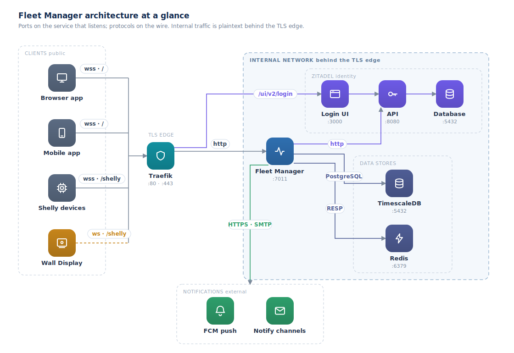
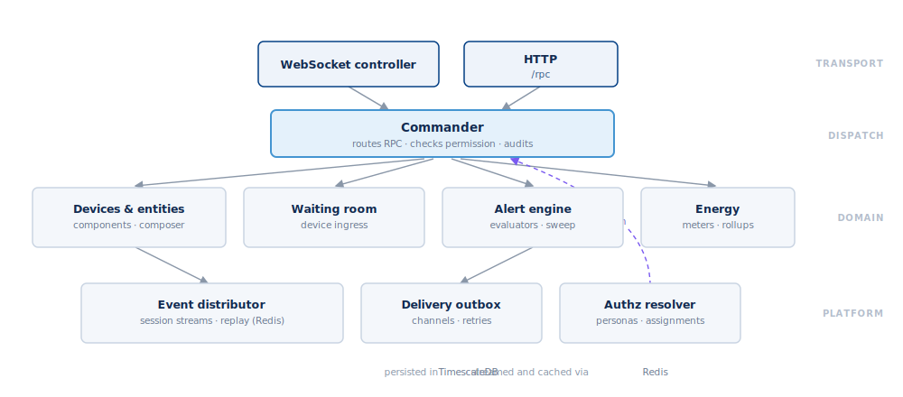

## Introduction

Fleet Manager is the control plane for a fleet of Shelly devices. Everything the
web app can do — discover and control devices, group them, run alerts and
schedules, read energy, manage users — is available through one API, and this
reference documents it.

### The mental model

- **One API, one connection.** The API is JSON-RPC 2.0 in the Shelly dialect:
  each frame carries `src` and `dst` routing fields on top of the usual
  `id`/`method`/`params`. You open a single authenticated WebSocket and send all
  your calls over it.
- **Namespaces and methods.** Capabilities are grouped into more than 120
  namespaces (`device`, `entity`, `alert`, `group`, `energy`, `schedule`, and
  so on) — over 1,200 operations in total. Every namespace answers a `Describe`
  call that lists its own methods, params, and permissions.
- **Live events on the same socket.** After you subscribe, the server pushes
  change notifications down the same connection. No second channel.
- **Devices behind the Fleet Manager.** Set `dst` to `FLEET_MANAGER` to call the
  Fleet Manager itself; set it to a device id to relay a call through to that
  device.

### Two ways to call

- **WebSocket** (`wss://<your-host>/`) — the primary transport. Required for
  live events; best for anything long-lived.
- **HTTP** (`POST /rpc`) — a fallback for one-off calls without a persistent
  socket. It talks to the Fleet Manager only and cannot subscribe to events.

### Where to go next

- [Quickstart](#quickstart) — connect, authenticate, and make your first call.
- [Authentication](#authentication) — browser sign-in and programmatic tokens.
- [Transport and framing](#transport-and-framing) — the exact frame shapes.
- [Events](#events) — subscribe to live updates.

The operation reference for every namespace is below this guide. The full
OpenAPI 3.1 spec for this exact deployment is at `/api/docs/openapi.json`.
