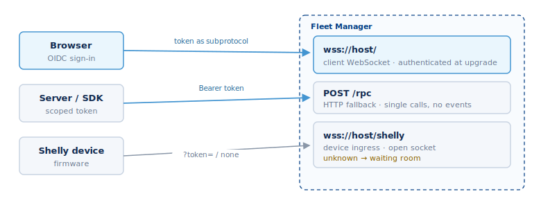

## Authentication



Every connection must sign in. There are two main ways for clients: a person
signing in through a browser, and tokens for servers and scripts. (Devices sign
in their own way — see [Device admission](#device-admission-the-waiting-room).)

### Which sign-in do I use?

| You are building… | Use | How you send it | Connect to |
| --- | --- | --- | --- |
| A web app, with a user signed in | The user's OIDC access token | As the WebSocket subprotocol: `new WebSocket(url, token)` | `wss://<host>/` |
| A server, script, or backend job | A scoped token (a PAT) | As a bearer header: `Authorization: Bearer <token>` | `wss://<host>/` or `POST /rpc` |
| A Shelly device you are adding | A one-time enrollment token | Set on the device; sent when it connects | `wss://<host>/shelly` |

**Rule of thumb:** a person in a browser signs in as themselves; anything running
on its own uses a scoped token.

### Browser sign-in (OIDC)

Fleet Manager uses Zitadel with the OIDC Authorization Code flow. After the user
signs in, open the WebSocket with the OIDC **access token as the subprotocol** —
browsers cannot set custom headers on a WebSocket, so the token rides in the
subprotocol slot:

```js
const ws = new WebSocket('wss://<your-host>/', accessToken);
```

The server validates the token on upgrade and closes the socket with code
`4401` if it is missing or invalid; the web client silently renews and
reconnects. The WebSocket does not rely on a cookie.

### Programmatic access (scoped tokens)

For server-to-server integrations, use a scoped access token and present it as a
bearer token — on the HTTP `/rpc` endpoint, or on the WebSocket upgrade for
non-browser clients:

```
Authorization: Bearer <token>
```

Create one with `user.CreateScopedPAT` (an admin operation):
- `boundaryScope` — narrows what the token may do. It can only *subtract* from
  the owner's permissions, never grant more.
- `purpose` — a free-text label for auditing.
- `expirationDays` — 1 to 365.

The call returns `{ tokenId, token, expirationDate }`, and the token string is
shown **once** — store it securely. Manage tokens with `user.ListScopedPATs`,
`user.RotateScopedPAT` (atomic revoke-and-mint), and `user.RevokeScopedPAT`.
Revoking a token drops any live session using it.

### Sessions and refresh

The server re-checks a token roughly every 30 seconds on an open socket, so
revocation takes effect quickly. Browser sessions renew silently in the
background; programmatic clients should refresh or rotate before expiry.

### Local development

With `FM_DEV_MODE=true`, a deployment accepts username/password login via
`User.Authenticate` (returning `access_token` and `refresh_token`; the seeded
account is `admin`/`admin`). This is for development only — production always
uses OIDC or scoped tokens.
