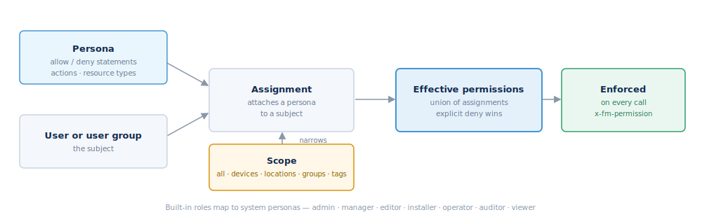

## Authorization and permissions

Every operation declares the permission it needs, and the server enforces it
before the call runs. A signed-in caller who lacks the permission gets
`PermissionDenied` (403 over HTTP); a caller with no identity gets `Unauthorized`
(401).

### Finding what an operation requires

Each operation carries an `x-fm-permission` field in this reference (and in the
OpenAPI spec), with up to three keys:
- `component` — the resource area, e.g. `devices`.
- `operation` — one of `create`, `read`, `update`, `delete`, `execute`.
- `note` — a label for special cases, e.g. `authenticated` or `public`.

For example, reading a device advertises `{ component: "devices", operation:
"read" }`. Operations marked `{ note: "public" }` need no permission. Every
namespace also answers a `Describe` call that lists its methods and their
permissions.

### How access is granted

Permissions follow an IAM-style model:
- A **persona** is a reusable bundle of allow/deny statements — actions,
  resource types, and optional conditions. Think of it as a policy.
- An **assignment** attaches a persona to a user or user group, optionally
  narrowed by a **scope**.

Your effective permissions are the union of the personas from your built-in
roles plus any direct and group assignments, inherited up the group tree.

There are eight built-in system personas: `admin`, `manager`, `editor`,
`installer`, `operator`, `automation_admin`, `auditor`, and `viewer`. A
deployment can define its own tenant personas on top of these.

### Scope

An assignment can be limited to a subset of the fleet: all, or specific
`device_ids`, `location_ids`, `device_group_ids`, `device_tags`,
`dashboard_ids`, or `plugin_keys`. An explicit `Deny` always wins over an
`Allow`.

### Scoped tokens

A scoped token carries a permission boundary that can only *narrow* what its
owner may do — it can never grant more. See [Authentication](#authentication)
for creating and using tokens.
