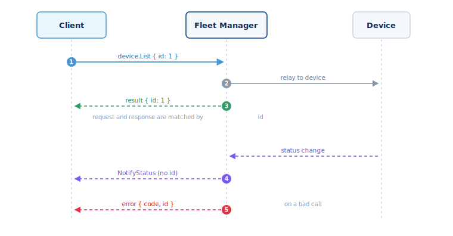
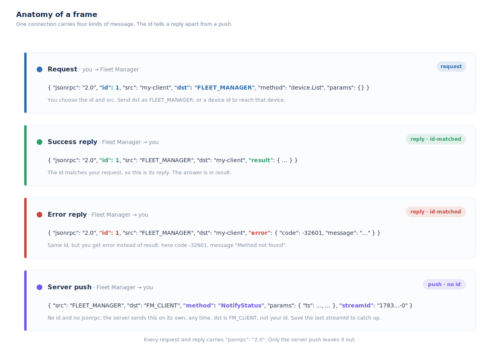

## Transport and framing



The API speaks JSON-RPC 2.0 over one WebSocket connection. Each message is a
small JSON object we call a **frame**. On top of the standard JSON-RPC fields,
every frame adds `src` and `dst` — who sent it, and who it is for. One signed-in
connection carries all your calls and every event the server sends back.

### How one exchange works

The numbers match the diagram above:

1. You send a **call** with an `id` you choose.
2. If `dst` is a device, Fleet Manager **relays** the call to it.
3. The **result** comes back with the same `id`. That is how you know it answers
   your call.
4. Separately, the server **pushes** a `NotifyStatus` event with no `id`. It is
   a live update, not a reply.
5. If the call was bad, you get an **error** — again with the same `id`.

### The four frames



Every message is one of four shapes. The `id` is the key. A reply carries the
same `id` as your call. A pushed event has no `id` at all.

### Endpoint

Connect to `wss://<your-host>/` — the root path (`ws://` on non-TLS
deployments). The socket must be authenticated at the upgrade; see
[Authentication](#authentication). Some deployments mount the API behind a
reverse-proxy path prefix, so the base path is configurable; the default is `/`.

There is also an HTTP fallback for single calls — see below.

### Request frame

```json
{
  "jsonrpc": "2.0",
  "id": 1,
  "src": "my-client",
  "dst": "FLEET_MANAGER",
  "method": "device.List",
  "params": {}
}
```

- `id` — required, a number. The response echoes it back so you can match
  replies to requests.
- `src` — required, any string that identifies your client. It is returned as
  the `dst` of the reply.
- `dst` — set to `FLEET_MANAGER` to call the Fleet Manager. A device id here
  relays the call to that device instead.
- `method` — `namespace.Method` (for example `device.List`). Method matching is
  case-insensitive.
- `jsonrpc` — optional; `"2.0"` if present.

### Success and error replies

```json
{ "jsonrpc": "2.0", "id": 1, "src": "FLEET_MANAGER", "dst": "my-client", "result": { } }
```

```json
{ "jsonrpc": "2.0", "id": 1, "src": "FLEET_MANAGER", "dst": "my-client",
  "error": { "code": -32601, "message": "Method not found" } }
```

Error handling — codes, validation details, and per-namespace error kinds — is
covered in [Errors](#errors).

### Batching

Send an array of request frames to run several calls over one message. The
batch cap is 100 frames (`FM_WS_MAX_BATCH_SIZE`); a larger batch is rejected
whole. Replies come back as individual frames, not a batched array.

### Message size and heartbeat

The maximum inbound frame is 5 MiB. The server pings roughly every 30 seconds
and terminates a socket that stops answering; reconnect with backoff on close.
Subscriptions are per-connection, so re-subscribe after reconnecting — see
[Events](#events).

### HTTP fallback

For one-off calls without a persistent socket, POST to `/rpc`:

```bash
curl -X POST https://<your-host>/rpc \
  -H 'content-type: application/json' \
  -d '{ "method": "device.List", "params": {} }'
```

You can also put the method in the path: `POST /rpc/device.List` with just the
`params` body. The HTTP path targets the Fleet Manager only — it does not relay
to devices, and needs no `src`/`dst`/`id` envelope. A success returns the bare
`result` as the body; an error returns `{ "error": { … } }` with a matching HTTP
status.
