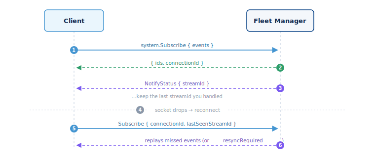

## Events



Fleet Manager sends you live events over the same connection you use for calls.
Events are opt-in. You subscribe once, and the server pushes an update whenever
something changes. Events work only over the WebSocket — the HTTP `/rpc`
fallback cannot subscribe.

### The flow, step by step

The numbers match the diagram above:

1. **Subscribe** to the events you care about.
2. Fleet Manager replies with your listener `ids` and a `connectionId`.
3. Events **push** to you as they happen. Each one carries a `streamId` — keep
   the last one you handled.
4. The connection **drops**. Reconnect and sign in again.
5. **Subscribe again**, this time sending the `connectionId` and your last
   `lastSeenStreamId`.
6. Fleet Manager **replays** the events you missed — or tells you to refetch
   with `resyncRequired`.

### Subscribe

Call `system.Subscribe` with the event names you want:

```json
{
  "id": 2, "src": "my-client", "dst": "FLEET_MANAGER",
  "method": "system.Subscribe",
  "params": { "events": ["Shelly.Status", "Shelly.Connect", "Alert.Created"] }
}
```

Optional `options` narrows delivery:
- `options.shellyIDs` — only events for these devices.
- `options.events.<name>.paths` — only frames where the named dot-path fields changed.

The reply returns the listener `ids`, a `connectionId`, and sometimes a
`resyncRequired` flag (see Reconnecting):

```json
{ "id": 2, "src": "FLEET_MANAGER", "dst": "my-client",
  "result": { "ids": [11, 12, 13], "connectionId": "c-9f3a…" } }
```

Stop listening with `system.Unsubscribe` and the ids you were given:

```json
{ "id": 3, "src": "my-client", "dst": "FLEET_MANAGER",
  "method": "system.Unsubscribe", "params": { "ids": [11, 12, 13] } }
```

### Notification frames

An event arrives as an id-less frame — `method`, `params`, and a `streamId`:

```json
{
  "method": "Shelly.Status",
  "params": {
    "shellyID": "shellyplus1-abc123",
    "status": { "switch:0": { "output": true } }
  },
  "streamId": "1684123456789-0"
}
```

Keep the `streamId` of the last frame you processed — you need it to resume
after a reconnect.

There are 63 event names. Common ones: `Shelly.Connect`, `Shelly.Status`,
`Shelly.Disconnect`, `Entity.StatusChange`, `Alert.Created`,
`Notification.Created`, `WaitingRoomEvent.Accepted`. Raw device notifications
(`NotifyStatus`, `NotifyEvent`) reach you wrapped inside `Shelly.Message`.

### Reconnecting and replay

Subscriptions live for the life of one socket. When the socket drops:

1. Reconnect and authenticate again.
2. Call `system.Subscribe` again, passing the earlier `connectionId` and
   `lastSeenStreamId` set to the last `streamId` you processed.

The server replays the events you missed from a per-session buffer — about the
last 10,000 events or one hour, whichever comes first. If the gap is too large
to fill, the reply's `resyncRequired` (or a `Session.ResyncRequired` frame)
tells you to refetch full state instead of trusting the replay; its values are
`no_offset`, `stream_expired`, and `stream_trimmed`.

This session-stream resume is how you avoid missing events. The `audit`
namespace is a separate admin query and export log — not an event channel.
