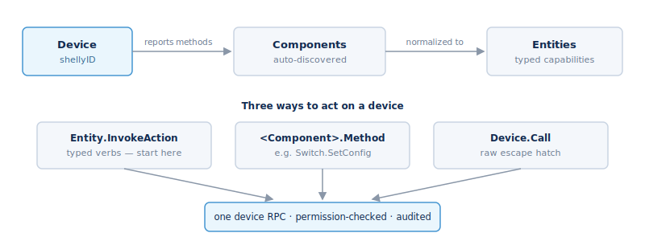

## The device model

The guiding rule: **the Shelly device is the source of truth for what it can
do.** Fleet Manager is authentication, audit, and transport on top of that — it
does not invent capabilities the device doesn't have.

### Identity

Every device is identified everywhere by its `shellyID` — a string you pass to
device-facing RPCs. There is no second identifier to track.

### Components

A **component** is an auto-discovered capability the device reports over RPC —
`switch`, `cover`, `light`, `em`, and so on. Nobody edits components; Fleet
Manager discovers them from the device's own `Shelly.ListMethods` and remembers
which methods that firmware advertises. That is why two devices of the "same
type" can expose different actions — the device answers for itself.

### Describe

Every namespace exposes a `Describe` method that returns its methods, their
params and responses, and the permission each needs. `kind: "device"` means the
call is relayed to the device firmware; `kind: "fleet-manager"` means Fleet
Manager serves it. `Describe` is how a client introspects the contract at
runtime instead of hardcoding it.

### Three ways to act on a device

All three end in a single device call. Each one is checked for permission and
written to the audit log. Pick by what you are doing:

| What you want to do | Use | Example | Notes |
| --- | --- | --- | --- |
| A common action — on, off, open | `Entity.InvokeAction` | `toggle`, `open` | Start here. Simple, named actions that work across device types. See [Entities](#entities). |
| Change a setting, or use a part's own method | `<Component>.<Method>` | `Switch.Set`, `Switch.SetConfig` | For settings and controls the simple actions don't cover. |
| Send a raw device command | `Device.Call` | any device method | An escape hatch for advanced cases. Prefer the options above. |

Start with `Entity.InvokeAction`. Reach for the others only when you need them.

### Kind

`device.list.kind` is the structural class of a device: `physical`,
`bluetooth`, `extracted`, `composed`, or `connector`. The last three are
[virtual devices](#virtual-devices). Before a physical device is usable it must
be admitted — see [Device admission](#device-admission-the-waiting-room).
