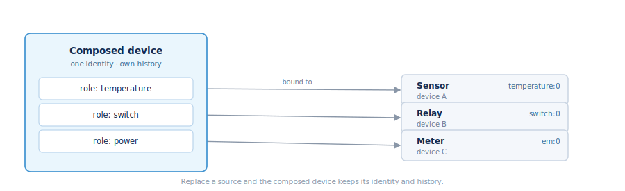

## Virtual devices

A **virtual device** is a first-class device in Fleet Manager that isn't a
single physical Shelly. It lets you represent non-Shelly or logical equipment,
keep its history when the underlying hardware is swapped, and reuse the same
device, entity, dashboard, alert, and permission surfaces you already use.

A virtual device has the same identity as a physical one — a row in the device
list, with a numeric `id` and a generated `external_id` (e.g. `vdev_…`). There
is no parallel identity model.

### Kinds

`device.list.kind` is the product-wide discriminator: `physical`, `bluetooth`,
`extracted`, `composed`, or `connector`. The last three are virtual:

- **Extracted** — a real downstream device promoted from a host Shelly (for
  example a Shelly Pill read over serial/Modbus by a host device).
- **Composed** — operator-defined logical equipment built from roles bound to
  components across several devices (for example a "Fireplace" that combines a
  relay, a temperature sensor, and a meter).
- **Connector** — a device reached through a protocol connector.

### How it works

A composed device's roles are **bound** to source components (a role slot maps
to something like `temperature:0` on a specific device). The device's live view
is projected at read time from those bindings plus the sources' latest state —
it is not a separate stored copy. Replacing a source is first-class: the old
binding is closed and a new one opened, and the virtual device's identity,
history, alerts, and dashboards carry over.

### Key methods (`virtualdevice` namespace)

- Lifecycle — `Create`, `Get`, `List`, `Update`, `Delete`.
- Building — `Extraction.Preview`/`Create`, `Profile.*`, `Binding.*`.
- Use — `Command.Invoke` (run a writable role on its active source),
  `History.*`, and `Manifest.*` for declarative apply.

### Not the same as "virtual components"

Shelly firmware has its own **virtual components** — `Boolean`, `Number`,
`Enum`, `Text`, `Button`, `Group` created on a device with `Virtual.Add` (ids
200–299). Those are software-only state living **on the device**, managed
through the `virtual` namespace (`Virtual.Add`, `Virtual.ComponentSet`,
`Virtual.Trigger`, …), and they surface as ordinary entities. A virtual
component is part of a device; a virtual device is a device.
