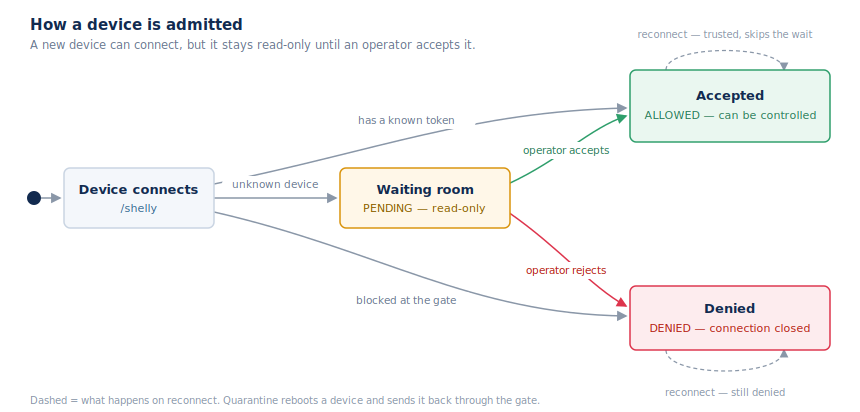

## Device admission (the waiting room)

A newly seen device is untrusted. It can open a socket, but it can do nothing —
and nothing about it is written to the database — until an operator accepts it.
The device's database row is created only on accept.

### How admission works

A device connects to `/shelly` and passes a gate that limits how often it can
try. Fleet Manager works out how the device is secured (`direct_token` or
`connector`) and decides what to do: accept it, send it to the waiting room, or
reject it.

While a device waits, Fleet Manager only reads from it — it cannot be controlled.
The full command handler is switched on only after the device is accepted. An
identity check also runs at admission, to stop a device pretending to be another.

Along the way Fleet Manager tracks three simple flags:

- **Seen before** — the device has connected at least once.
- **Identified** — it has said hello on this connection.
- **Trusted** — it has been accepted, so it skips the waiting room next time.

### Operating the queue (`waitingroom` namespace)

- **List** pending devices — `WaitingRoom.List` (or the legacy
  `WaitingRoom.GetPending`); `WaitingRoom.GetCounts` for badges;
  `WaitingRoom.Probe` for a read-only look at a live waiting device.
- **Accept** — `WaitingRoom.AcceptPendingById` or
  `WaitingRoom.AcceptPendingByExternalId` (the canonical form is
  `WaitingRoom.Approve`). Accepting creates the device row, stamps the
  organization, and allows control. Bulk accept runs as a background job
  (`WaitingRoom.AcceptBulkStart` then poll `WaitingRoom.AcceptBulkStatus`).
- **Reject** — `WaitingRoom.RejectPending` (canonical `WaitingRoom.Reject`)
  denies the device and closes its socket; the decision sticks on reconnect.
  `WaitingRoom.Quarantine` is destructive — it rewrites the device's connection
  config and reboots it.

A device's access state on the record is `PENDING`, `DENIED`, or `ALLOWED`. Once
`ALLOWED`, it becomes a normal managed device — see
[The device model](#the-device-model).
