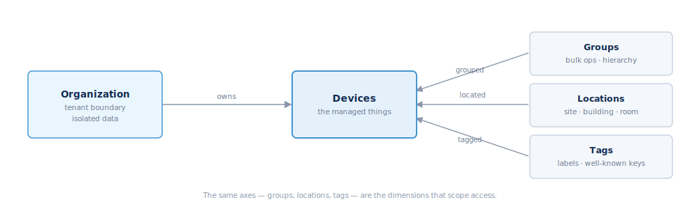

## Organizations, groups, and tags

Fleet Manager organizes a fleet along a few independent axes. Understanding them
makes the device, permission, and dashboard APIs fall into place.

### Organizations

An **organization** is the top-level tenant boundary. Every user belongs to
exactly one, and isolation is strict — one org never sees another's data. A
device attaches to an org when it is first approved (before that it has no
owner). The org profile carries the defaults everything else inherits:
`timezoneDefault`, `localeDefault`, `currencyDefault`, `unitSystemDefault`.

`organization` methods: `GetProfile`, `SetProfile`, `GetDefaults`, and
`GetScopeModel` — the last returns the building blocks (location kinds, group
types, tag subject types) so a client can build forms without hardcoding them.

### Groups

A **group** is a per-org collection of devices, entities, or locations, with a
parent/child hierarchy. Groups have two independent axes:

- `groupType` — a policy tier (`standard`, `operational`, `critical`, `custom`)
  that drives alert-severity floors and retention defaults.
- `kind` — a semantic class from a catalog (default `manual`).

Membership is manual. `group` methods include `Create`/`Update`/`Delete`,
`Get`/`List`, `Children`/`Path`, `ListMembers`, and `AddMembers`/`RemoveMembers`
(batched, up to 500 per call).

### Locations

A **location** is physical placement, in a hierarchy of 14 kinds from
`continent` down to `zone` (`site`, `building`, `floor`, `room`, …). A device,
entity, or group maps to a single primary location, and each location inherits
`timezone`, `countryCode`, and `currency` from its parents. `location` methods
include the tree operations plus `SetAssignment`/`RemoveAssignment`/
`ListAssignments` and `SearchPlaces`.

### Tags

A **tag** is a per-org label you can attach to eight subject types (device,
entity, group, location, alert rule, and more). Some keys are reserved with a
fleet-wide meaning: `critical`, `under-warranty`, `submetered`,
`tenant-billable`, `backup-powered`, `demand-response`. `tag` methods:
`Create`/`Update`/`Delete`, `Get`/`List`, `Assign`/`Unassign` (batched,
idempotent), and `ListForSubject`.

### Fleet vs a scope

"Fleet" is not an entity — it is the whole-org slice with no axis selected. A
scope narrows to a single axis (one group, one location, or one tag). The
`fleet` namespace aggregates live metrics for whatever slice you pass
(`GetMetrics`, `GetCapabilities`).

These same axes — `device_ids`, `location_ids`, `device_group_ids`,
`device_tags` — are exactly the scope dimensions used to narrow a permission
grant. See [Authorization and permissions](#authorization-and-permissions).
