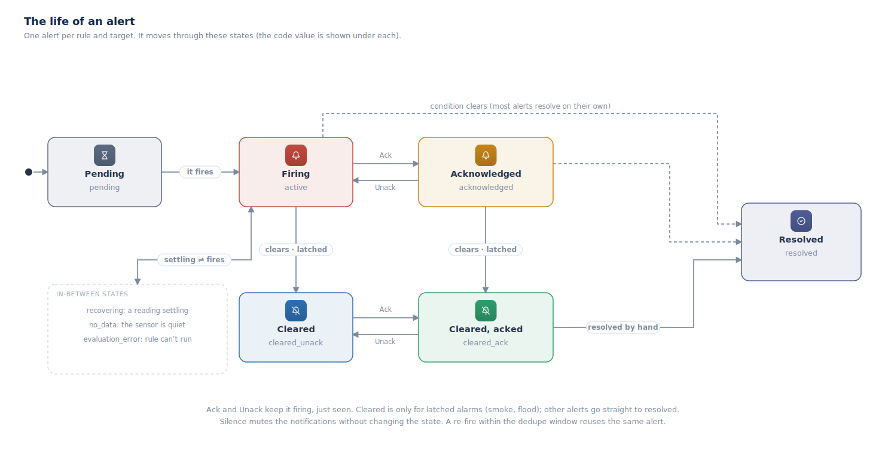

## Alerts and notifications

An **alert rule** watches your fleet and, when it fires, turns into
notifications delivered over your chosen channels. Rules are org-scoped and carry
a `name`, a `kind`, a `severity` (`info`, `warning`, `critical`), a `scope`
(device, component, group, location, or tag), dedupe/cooldown windows,
destinations, and a per-kind `config`.

### Rule kinds

There are 20 kinds, grouped by how they evaluate:

- **Threshold** — `component_threshold`, `component_state`,
  `energy_consumption_threshold`, `battery_below`.
- **Inactivity** — `device_offline`, `heartbeat`.
- **Delta** — `rate_of_change`, `stuck_sensor`.
- **Event** — `device_back_online`, `smoke_alarm`, `flood_alarm`,
  `motion_detected`, `firmware_operation_failed`, `backup_operation_failed`,
  `automation_run_failed`, `grafana_alert`, `change_event`, `device_event`.
- **Anomaly / composite** — `anomaly_band`, `composite` (AND/OR/NOT over other
  rules).

Each kind has its own `config` (for example `component_threshold` takes
`component`, `field`, `operator`, `threshold`, and an optional sustained
`forSec`). `Alert.Rule.ListKinds` returns the catalog.

### How rules evaluate

Two paths, and the kind decides which:

- **Event-driven** — most kinds evaluate the moment a device connects,
  disconnects, or reports status.
- **Periodic sweep** — time- and absence-based kinds (`heartbeat`,
  `energy_consumption_threshold`, `rate_of_change`, `stuck_sensor`) can only be
  judged on a timer, so a leader-gated sweep evaluates them about every 30
  seconds. Sustained thresholds and deferred `device_offline` are scheduled the
  same way.

### The life of an alert

When a rule fires, it opens one **alert** for each thing it is watching. That
alert then moves through a set of states:

- **Firing** (`active`) — the problem is happening now.
- **Acknowledged** — someone has seen it. *Ack* and *Unack* move the alert
  between these two; it is still firing either way.
- **Cleared** (`cleared_unack` / `cleared_ack`) — for latched alarms like smoke
  and flood, the alert stays visible after the condition ends, so no one misses
  it. You acknowledge it, then resolve it by hand.
- **Resolved** — the problem is over and the alert is closed. Most alerts resolve
  on their own the moment the condition clears.

Two more states cover the gaps: **Pending** (waiting to see if a problem lasts
long enough to matter) and a small set of interim states — **recovering**,
**no data**, and **evaluation error** — for when a reading is settling, a sensor
goes quiet, or a rule can't be checked. **Silence** is separate: it mutes the
notifications without changing the state.

### Rules and instances

- Rules — `Alert.Rule.Create`/`Update`/`Delete`, `List`/`Get`, `Preview`,
  `CreateFromTemplate`. A rule must name at least one destination.
- Firing instances — `Alert.Instance.List`/`Get`, `Ack`/`Unack`,
  `Silence`/`Unsilence`, `ResolveManual`, `Annotate`.

### Delivery

When a rule matches, Fleet Manager upserts an alert instance (idempotent by
fingerprint), writes inbox items, and — subject to the cooldown — creates
delivery jobs that an outbox worker sends through channel adapters:
`email_smtp`, `generic_webhook`, `slack_webhook`, `teams_workflow_webhook`,
`telegram_bot`, `push_fcm`, `sms_twilio`, `voice_twilio`, and `webhook_signed`.
Wording comes from the rule's inline `summaryTemplate`/`messageTemplate` or a
reusable message template (per-channel bodies plus a fallback). `deliveryMode`
is `instant` or `digest`; failed sends retry with a capped attempt count before
dead-lettering.

### The inbox (`notification` namespace)

Fired alerts also land in an in-app inbox: `Notification.Inbox.List`/`Get`,
`MarkRead`/`MarkUnread`/`MarkAllRead`. The namespace also manages destination
groups, delivery `History`, channels, per-user `Preference`s, on-call schedules,
and routing policies. Live updates arrive as `Alert.Created`/`Updated`/
`Resolved` and `Notification.Created` events (see [Events](#events)).
