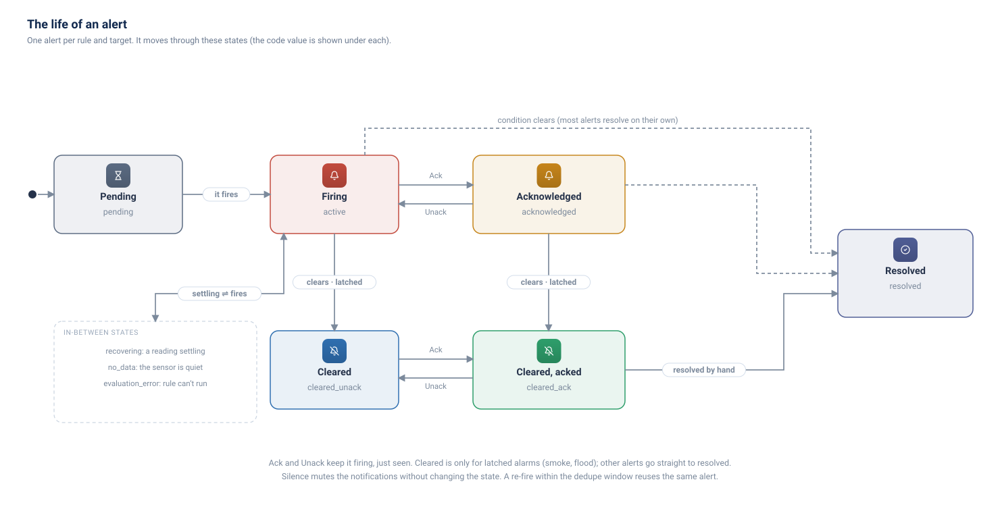

## Alerts and notifications

An **alert rule** watches your fleet and, when it fires, turns into
notifications delivered over your chosen channels. Rules are org-scoped and carry
a `name`, a `kind`, a `severity` (`info`, `warning`, `critical`), a `scope`
(device, component, group, location, or tag), dedupe/cooldown windows,
destinations, and a per-kind `config`.

### Rule kinds

There are 25 kinds, grouped by how they evaluate:

- **Threshold**: `component_threshold`, `component_state`,
  `energy_consumption_threshold`, `cost_budget_threshold`,
  `approaching_new_peak`, `battery_below`.
- **Inactivity**: `device_offline`, `heartbeat`, `record_incomplete`,
  `credential_expiring`.
- **Delta**: `rate_of_change`, `stuck_sensor`.
- **Event**: `device_back_online`, `smoke_alarm`, `flood_alarm`,
  `motion_detected`, `firmware_operation_failed`, `backup_operation_failed`,
  `automation_run_failed`, `grafana_alert`, `change_event`, `device_event`,
  `system_health`.
- **Anomaly / composite**: `anomaly_band`, `composite` (AND/OR/NOT over other
  rules).

Each kind has its own `config` (for example `component_threshold` takes
`component`, `field`, `operator`, `threshold`, and an optional sustained
`forSec`). `Alert.Rule.ListKinds` returns the catalog.

A gateway exposes every BLU reading as `bthomesensor:N`; only the BTHome
object name says what it measures. `component_threshold` and
`component_state` take an optional `objName` (for example `carbon_monoxide`,
`pressure`) so a `bthomesensor:*` watch reads only that object. Wired sensors
use a type wildcard (`temperature:*`) so add-on peripherals such as
`temperature:100` count too.

### How rules evaluate

Two paths, and the kind decides which:

- **Event-driven**: most kinds evaluate the moment a device connects,
  disconnects, or reports status.
- **Periodic sweep**: time- and absence-based kinds (`heartbeat`,
  `energy_consumption_threshold`, `rate_of_change`, `stuck_sensor`) can only be
  judged on a timer, so a leader-gated sweep evaluates them about every 30
  seconds. Sustained thresholds and deferred `device_offline` are scheduled the
  same way.

### The life of an alert

When a rule fires, it opens one **alert** for each thing it is watching. That
alert then moves through a set of states:

- **Firing** (`active`): the problem is happening now.
- **Acknowledged**: someone has seen it. *Ack* and *Unack* move the alert
  between these two; it is still firing either way.
- **Cleared** (`cleared_unack` / `cleared_ack`): for latched alarms like smoke
  and flood, the alert stays visible after the condition ends, so no one misses
  it. Acknowledging it closes it: both cleared states count as history, and
  there is no separate resolve step.
- **Manual resolve**: `Alert.Instance.ResolveManual` is refused with
  `UnsupportedOperation` for every kind that closes itself when the condition
  clears (this includes smoke and flood). It works only for
  `firmware_operation_failed`, `backup_operation_failed`,
  `automation_run_failed`, `grafana_alert`, `system_health`,
  `cost_budget_threshold`, `composite`, `change_event` and `device_event`.
  One exception: an alert whose sensor was deleted can still be resolved.
- **Resolved**: the problem is over and the alert is closed. Most alerts resolve
  on their own the moment the condition clears.

Acting on an alert that is already resolved follows one rule. If what you asked
for is already true, the call succeeds and changes nothing: a second
`ResolveManual` returns the alert as it stands. If what you asked for cannot
happen, the call is refused with `ResourceConflict`: `Ack`, `Unack`, `Silence`
and `Unsilence` all change a live alert, and a resolved alert is not live.

Two more states cover the gaps: **Pending** (waiting to see if a problem lasts
long enough to matter) and a small set of interim states (**recovering**,
**no data**, and **evaluation error**) for when a reading is settling, a sensor
goes quiet, or a rule can't be checked. **Silence** is separate: it mutes the
notifications without changing the state.

### Rules and instances

- Rules: `Alert.Rule.Create`/`Update`/`Delete`, `List`/`Get`, `Preview`,
  `CreateFromTemplate`. Create refuses a rule that has no destination group
  and no destination channel. Update refuses an edit that would leave it with
  neither.
- Firing instances: `Alert.Instance.List`/`Get`, `Ack`/`Unack`,
  `Silence`/`Unsilence`, `ResolveManual`, `Annotate`.

### Delivery

When a rule matches, Fleet Manager upserts an alert instance (idempotent by
fingerprint), writes inbox items, and (subject to the cooldown) creates
delivery jobs that an outbox worker sends through channel adapters:
`email_smtp`, `generic_webhook`, `slack_webhook`, `teams_workflow_webhook`,
`telegram_bot`, `push_fcm`, and `webhook_signed`. `sms_twilio` and `voice_twilio` exist in
the provider list but are disabled (`enabled: false`).
Wording comes from the rule's inline `summaryTemplate`/`messageTemplate` or a
reusable message template (per-channel bodies plus a fallback). `deliveryMode`
is `instant` or `digest`; failed sends retry with a capped attempt count before
dead-lettering.

### The inbox (`notification` namespace)

Fired alerts also land in an in-app inbox: `Notification.Inbox.List`/`Get`,
`MarkRead`/`MarkUnread`/`MarkAllRead`. The namespace also manages destination
groups, delivery `History`, channels, per-user `Preference`s, on-call schedules,
and routing policies. Live updates arrive as `Alert.Created`/`Updated`/
`Resolved` and `Notification.Created` events (see [Events](#events)).
