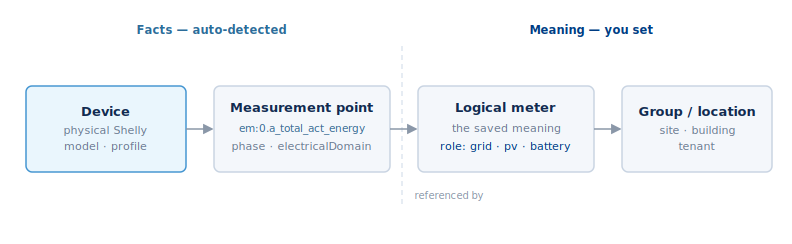
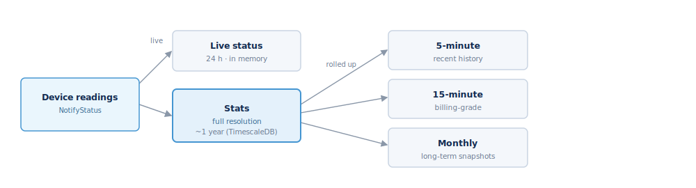

## Energy model

The energy model follows one rule: **auto-detect facts, ask people for
meaning.** Fleet Manager works out the physics from the device; you tell it what
a reading *means* for your site.

### The layers

- **Device** — the physical Shelly. Facts are auto-detected: model, app,
  profile, and which components it exposes.
- **Measurement point** — one readable quantity on a channel or phase, e.g.
  `em:0.a_total_act_energy` or `switch:1.apower`. Facts are auto-detected:
  component key, channel, phase, tag, and `electricalDomain`.
- **Logical meter** — the saved *meaning*: "Main grid meter", "Solar
  generation", "Tenant A". This is where a `role` lives. A logical meter does
  not appear in the device list and controls nothing; it is a reporting object
  that references measurement points.
- **Role** — a utility-specific source role, not an appliance catalog:
  `grid`, `pv`, `battery`, `generator`, `ev_charge`, `load`, `aux` (and
  `supply`/`production`/`storage`/`usage`/`aux` for gas/water/heat).
- **Group / location** — where and to whom it belongs (site, building, tenant).

`electricalDomain` (`ac_mains`, `dc_pv`, `dc_battery`, `dc_bus`, `thermal`) is a
physics fact, kept separate from `role`: an inverter's AC output is
`ac_mains`/`role: pv`, its DC string is `dc_pv`/`role: pv`.

### Meters

The raw sources are real device components — `EM` (three-phase), `EM1`
(single-phase), `PM1`, plus `EMData`/`EM1Data` for device-stored history. A
logical meter sits on top: a **physical meter** sums its points; a **calculated
meter** is a formula over other meters. Fleet Manager keeps raw readings at full
resolution for about a year, with monthly, 5-minute, and 15-minute billing
rollups on top.

### Reading energy (`energy` namespace)

- `Energy.Query` — time-series for charts, scaled to display units. It can also
  **group** the result with `groupBy` (`meter`, `role`, `kind`, or `utility`)
  and add `totals`, so a single call returns a breakdown — for example energy
  by role (grid vs pv vs battery) or by utility — as `groups`, ready to chart.
- `Energy.Current` — live instantaneous power, no database read.
- `Energy.ListMeasurementPoints`, `Energy.ListLogicalMeters`,
  `Energy.SaveLogicalMeter` — inspect points and define meaning.
- `Energy.SetPointOverride` — correct a point's domain/tag in rare cases.

### Reports (`report` namespace)

Reports are asynchronous. `Report.Generate` returns a `jobId` immediately;
`kind` is `energy` (a formatted cost/tariff/CO₂ report, `html` or `csv`) or
`interval` (per-device load-profile CSV). Poll `Report.GetReport` until it
returns a `downloadUrl`; `Report.Cancel` stops a running job, and
`Report.SuggestTimeShift` proposes the best load shift against grid carbon
intensity. Energy reports take a `period`, `granularity`, `tariff`, `currency`,
`timezone`, and `pv_mode`.
