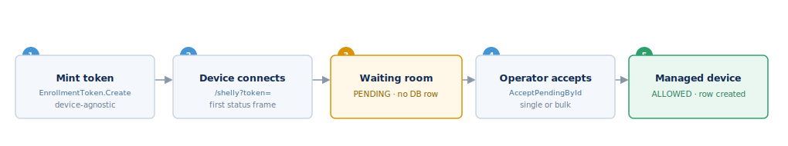

## Provisioning a device



Provisioning is getting a Shelly device connected to your Fleet Manager and
enrolled, so it shows up for approval. Accepting it afterwards is covered in
[Device admission](#device-admission-the-waiting-room).

### Point the device at Fleet Manager

A device connects over WebSocket to the `/shelly` endpoint. Set its outbound WS
config to your instance:

```json
{ "method": "WS.SetConfig",
  "params": { "config": { "server": "wss://<your-host>/shelly", "enable": true } } }
```

### Choosing the connection

The `server` URL has two choices.

**`ws://` or `wss://`.** Both are accepted. Use `wss://` (TLS) in production;
`ws://` is for local or non-TLS setups.

**With or without a token.** The URL can carry an optional token — the device's
credential — and, optionally, its identity:

- `?token=<token>` — the credential. A device that presents a known token is on
  the recognized path: it is accepted, or routed to that token's organization
  waiting room. (A non-browser client may send it as `Authorization: Bearer`
  instead.)
- `?id=<external-id>` — the device's claimed identity. Without it, Fleet Manager
  identifies the device from the `src` field of its first status frame.

So a device connects one of two ways:

- **With a token** — it is recognized or enrolled and routed to the right
  organization automatically.
- **Without a token** — it is an unknown device: it lands in the waiting room
  for an operator to accept, or is refused if the waiting room is turned off.

Example with both values: `wss://<your-host>/shelly?id=<external-id>&token=<token>`.

On reboot the device connects, sends its first status frame, and Fleet Manager
runs admission — see [Device admission](#device-admission-the-waiting-room).

### Enroll many devices with a token

For onboarding at scale, mint a device-agnostic **enrollment token** —
`deviceIngress.EnrollmentToken.Create` (`{ validityMinutes, maxUses,
preferredProfileId? }`; up to 1440 minutes and 1000 uses). It returns a one-time
URL like `<public-ws-base>?token=<token>`. Point devices at that URL; each
connects, consumes the token, and lands in that organization's waiting room.
Manage tokens with `EnrollmentToken.List` / `EnrollmentToken.Revoke`.

### Guided per-device provisioning

For a single device, `deviceIngress.Setup.Plan` (`{ reportedExternalId, model?,
preferredProfileId?, … }`) returns a session plus a provisioning **bundle**: the
device's WS config and a one-time token. Apply the bundle to the device, then
report the outcome with `deviceIngress.Setup.ReportApply` (`{ sessionId, status,
applyMethod }`). Built-in profiles include `shelly-pro-em-wss-token`,
`wall-display-local-ws`, and `modbus-tcp-connector`.

### Hand-off to admission

A newly enrolled device is untrusted and waits — no database row is created
until an operator accepts it. Complete onboarding with
`WaitingRoom.AcceptPendingById`, or `deviceIngress.WaitingRoom.Approve` for the
ingress path.

### Mobile and installer apps

An installer app authenticates with a scoped token (see
[Authentication](#authentication)) and can bootstrap in one round-trip with
`mobile.GetBootstrap` — a slim device list plus waiting-room and alert counts.
Repeatable device settings live in config profiles, fetched per device with
`Device.GetSetup` (`{ mode: "rpc" }`).
