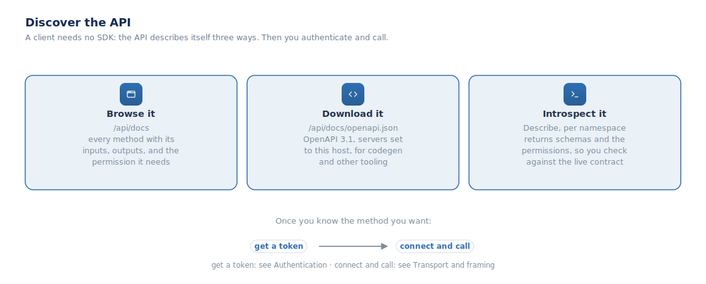

## Building a client

A "client" is any program that talks to Fleet Manager: a nightly script, your
own app, or another company's server. You do not need an SDK. The API describes
itself, and you connect with plain WebSocket or HTTP.

### 1. Read the API list

Every running instance serves its own API reference. The docs page at `/api/docs`
lists all ~1,200 methods, each with its inputs, outputs, and the permission it
needs. The same list is also a downloadable OpenAPI 3.1 file at
`/api/docs/openapi.json`, with the `servers` field set to that host.

Each method is named `Namespace.Method`, for example `device.List`. You call it
the same way over either transport; only the wrapper differs.

### 2. Get a token

A call has to prove who you are. Get a token from
[Authentication](#authentication). Over the WebSocket the token is the
subprotocol; over HTTP it is an `Authorization: Bearer` header.

### 3. Connect and call

Send a request, read the reply, and match the reply to your request by its `id`.

- **WebSocket** (the main transport): open one authenticated socket and send
  JSON-RPC frames. Use this for anything long-lived or event-driven. Wrap your
  call in the `{ jsonrpc, id, src, dst, method, params }` envelope and match
  replies by `id`. See [Transport and framing](#transport-and-framing).
- **HTTP** (simple calls): `POST /rpc` with `{ method, params }` and a bearer
  token, or `POST /rpc/{Namespace}.{Method}` with just the params. One call, one
  reply, no events.

Copy-paste examples for the common parts are in the guides:
[Quickstart](#quickstart), [Events](#events), [Errors](#errors), and
[Pagination and filtering](#pagination-and-filtering).

### Introspect at runtime

Every namespace also answers a `Describe` call that returns its methods, param
and response schemas, and required permissions, so a client can validate against
the live contract instead of pinning a copy. Mind the [rate limits](#rate-limits).

Note: the Host SDK in the web frontend is for building UIs and templates against
Fleet Manager, not for external server-to-server clients. Those read the API
list and connect as above.
