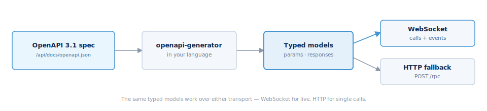

## Building a client



There is no first-party SDK yet — the OpenAPI spec is the contract, and it is
enough to generate typed models and build a client in any language.

### Start from the spec

Every running instance serves its own OpenAPI 3.1 document at
`/api/docs/openapi.json`, with the `servers` field rewritten to that host. Each
operation appears as `POST /rpc/{Namespace}.{Method}` with typed `params` and
response schemas and an `x-fm-permission` extension. Point a generator at it:

```bash
npx @openapitools/openapi-generator-cli generate \
  -i https://<your-host>/api/docs/openapi.json \
  -g typescript-fetch -o ./fm-client
```

That gives you typed request/response models for all ~1,200 operations. The
same models apply whether you call over HTTP or WebSocket — only the transport
differs.

### Pick a transport

- **HTTP** — call `POST /rpc` with `{ method, params }` and a bearer token. The
  simplest path; good for scripts and request/response integrations. No events.
- **WebSocket** — open one authenticated socket and send JSON-RPC frames. Use
  this for anything long-lived or event-driven. The frame is small; wrap the
  generated `params`/response types in the `{ jsonrpc, id, src, dst, method,
  params }` envelope and match replies by `id`. See
  [Transport and framing](#transport-and-framing).

### Introspect at runtime

Every namespace answers a `Describe` call that returns its methods, param and
response schemas, and required permissions — so a client can validate or
generate against the live contract instead of pinning a copy. Handle failures
with the shared error shape in [Errors](#errors), and mind the
[rate limits](#rate-limits).

Note: the Host SDK in the web frontend is for building UIs and templates against
Fleet Manager, not for external server-to-server clients — for those, generate
from the OpenAPI spec as above.
