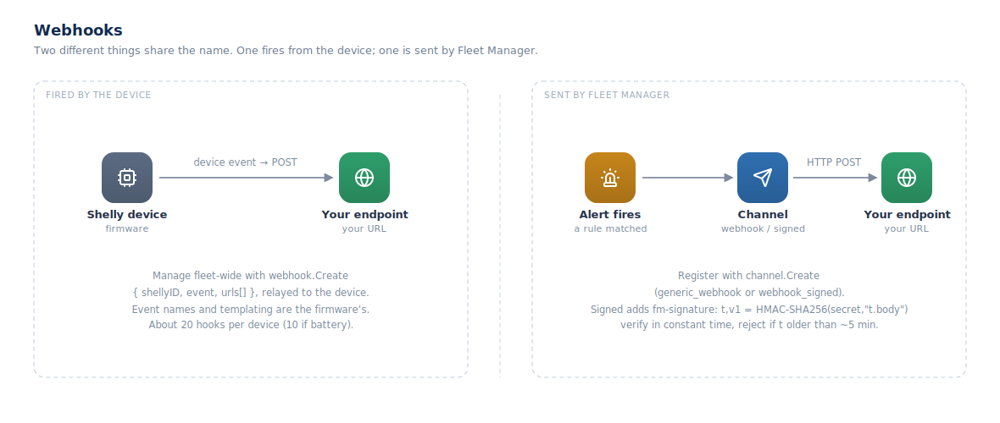

## Webhooks

Two unrelated things share the name "webhook" in Fleet Manager. Keep them
straight.

### Device webhooks (fired by the device)

Shelly devices fire their own outbound HTTP webhooks on device events. You
manage them fleet-wide through the relayed `webhook` namespace — the calls are
forwarded to the device:

- `webhook.List`, `webhook.ListSupported` / `webhook.ListAllSupported` (event
  types this firmware supports).
- `webhook.Create` — `{ shellyID, event, urls[] }` plus optional `enable`,
  `name`, `condition`, `active_between`, `repeat_period`.
- `webhook.Update`, `webhook.Delete`, `webhook.DeleteAll`.

The event names, URL templating, and conditions are owned by the device
firmware, and device limits apply (around 20 hooks per device). These fire from
the device, not from Fleet Manager.

### Alert-delivery webhooks (sent by Fleet Manager)

To receive fired alerts at your own HTTP endpoint, register a delivery channel
and use it as an alert destination:

- `channel.Create` with provider `generic_webhook` (a plain JSON POST) or
  `webhook_signed` (HMAC-signed). `channel.Test` sends a test.
- `generic_webhook` config: `url`, optional `method` (POST), `headers[]`,
  `bodyTemplate`.
- `webhook_signed` config: `url` (https only) and a `signingSecret` (≥32 chars).
  Fleet Manager adds an `fm-signature: t=<unix>,v1=<hex>` header, where `v1` is
  `HMAC-SHA256(secret, "<t>.<raw-body>")`. **Verify it** on your side: recompute
  the HMAC over `"<t>.<body>"`, compare in constant time, and reject if `t` is
  older than ~5 minutes.

A channel can be shared by several rules and destination groups. See
[Alerts and notifications](#alerts-and-notifications).
